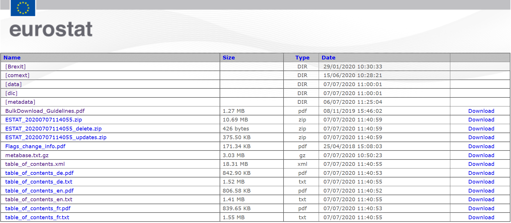
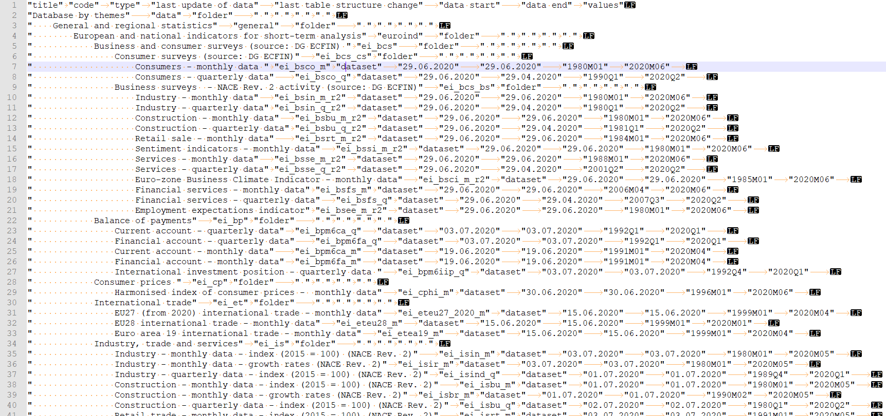
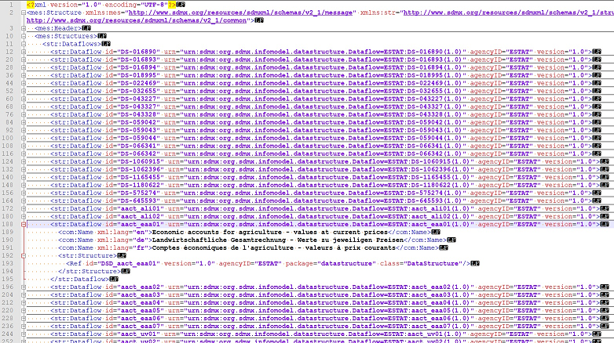

```{r pretty, echo = F, eval = F}
library (prettydoc, # Pretty HTML output v0.3.1
              quietly=T, warn.conflicts=F, logical.return=F)
```

# The Eurostat's Bulk Download Facility (a very preliminar version)

In this post there is a brief introduction to a continuous integration (CI) approach for data ingestion using Eurostat as data source for Data Scientists.

In my humble opinion Data Scientists making efforts to device projects with sort of CI and Deployment focus add extra value to the research phase of a project. That is because I believe they provide work processes using methods to better coordinate with the implementation (deployment) phases.

The downside of this "mentality" is that Data Scientist need more time to understand the project as a whole, understand and implement methods, and, most importantly, the ability to clearly see and set the boundaries of the research work - as in this mentality boundaries between research and implementation phases within a project become fuzzier-.

```{r setup, echo=F}
#Those are local folders for my convenience, please ignore.
loc  <- "G://00_PhD_II//Rfolder//bulkdwEC//" #getwd()
loca <- "G://00_PhD_II//Rfolder//bulkdwEC//auxi//"
locd <- "G://00_PhD_II//Rfolder//bulkdwEC//data//"
loct <- "G://00_PhD_II//Rfolder//bulkdwEC//temp//"


#Libraries:
# install.packages(
  # c("tidyverse", "lubridate", "eurostat", 
    # "knitr", 
    # "ggfortify", "changepoint", "strucchange", "ggpmisc")
  # )

    library (tidyverse, # Data Management v1.3.0*
              quietly=T, warn.conflicts=F, logical.return=F)
    library (lubridate, # Dates management V1.7.8
              quietly=T, warn.conflicts=F, logical.return=F)
    library (eurostat, # Retrieve time series from Eurostat
              quietly=T, warn.conflicts=F, logical.return=F)
    library (knitr, # Table formatting v1.28
             quietly=T, warn.conflicts=F, logical.return=F)
    library (ggfortify, # Time Series analysis v0.4.10
             quietly=T, warn.conflicts=F, logical.return=F)
    library (changepoint, # Time Series analysis v2.2.2
             quietly=T, warn.conflicts=F, logical.return=F)
    library (strucchange, # TS Change points v1.5.2
             quietly=T, warn.conflicts=F, logical.return=F)
    library (ggpmisc, # TS picks and valleys v0.3.5
             quietly=T, warn.conflicts=F, logical.return=F)

# *tidyverse 1.3.0 includes:
    # v ggplot2 3.3.0     v purrr   0.3.4
    # v tibble  3.0.1     v dplyr   0.8.5
    # v tidyr   1.1.0     v stringr 1.4.0
    # v readr   1.3.1     v forcats 0.5.0
```

In this post you can review a proposal for completely or partially automate data set updates using R, although it provides useful links for a full-integrated development using SDMX Web Services and APIs.

This is work-in-progress document. Please feel free to send any comments, my contact info here https://ibeleni.com/

## Introduction

When approaching the challenge of systematically maintain data ingestion from Eurostat with few DevOps resources, one can use Eurostat's <a href = "https://ec.europa.eu/eurostat/data/bulkdownload">Bulk Download Facility</a>

Updates are done twice a day, at 11:00 and 23:00, and the data is available in two formats: tsv (tab separated values) and SDMX (Statistical Data and Metadata eXchange).

Those allow access to updated "plain text" versions of table of content (TOC) of their data structure and data sets using (<a href="https://www.w3.org/TR/ws-arch/#relwwwrest">REST requests</a>) patterns available, which can be easily implemented in "R/Phyton-minded" research projects.


### 1- Eurostat's Bulk Download: TSV and SDMX. Retrieve data from Eurostat using R.

This approach allows either for Data Scientist to device CI frameworks for data ingestion, or data management and feature engineering / selection.


There are 3 simple steps to retrieve data from Eurostat using R: fetch the list of available data, identify the data sets/tables needed, fetch them. 

Although there's is a recommended previous step which is understanding how Eurostat structures things.

#### 1.1 Previous step: basics of Bulk Download Facility.

Have a look at the <a href = "https://ec.europa.eu/eurostat/estat-navtree-portlet-prod/BulkDownloadListing?sort=1&dir=">Bulk Download Listing </a>.

Here you will easily understand what information is available. Specially review the PDF document <i>BulkDownload_Guidelines.pdf</i>.

{#id .class width=50% height=50%}

The first thing you need to notice is that lists describing the Data Structure will include not only information about data sets or tables but also information on folders and files.

An advantage of official statistics is that they rely on well-established standards and have been developing from quite a while. Meaning that once a table/data flow is properly identified its REST request statement to files/folders remain consistently in place. Therefore we can rely on this structure to remain stable and build upon it in our CI framework.

#### 1.2 One, two, three... data!

To keep it straight forward I will start downloading the English version of the table of content, then I will look for time series related to Excessive Dept Procedure (EDP) and retrieve it.


##### 1st step - Retrieve list of available data in the facility.

Start downloading the English version of the table of content <a href = "https://ec.europa.eu/eurostat/estat-navtree-portlet-prod/BulkDownloadListing?sort=1&file=table_of_contents_en.txt">TOC file: table_of_contents_en.txt</a> available in the Bulk Download Facility which is "plain text" (Tab separated values file or tsv):

{#id .class width=50% height=50%}


```{r data_origin_list}
#Create a connection using the REST request:
      con <- "https://ec.europa.eu/eurostat/estat-navtree-portlet-prod/BulkDownloadListing?sort=1&file=table_of_contents_en.txt"

      #List all data flows: data frame of the TOC in English.
      tbcont <- read.table (con, header = T, sep = "\t")
      library(stringr)
      tbcont$title <- str_trim (tbcont$title) #trim title string
```

Reading the data in R we can see that there are `r dim (tbcont[which (tbcont$type=="table"),])[1]` tables. 

```{r data_origin_list_tab, echo = F, eval = F}
#Have a look:
      kable ( 
        head (tbcont)
      )
```

Searching through the text for the table codes we may be interested in, does not require high programming skills while it allows for systematic integration. Let's see how.


##### 2nd step - Identify the series of data we are interested in: codes

Specific data sets are available in the<a href="https://ec.europa.eu/eurostat/estat-navtree-portlet-prod/BulkDownloadListing?sort=1&dir=data"> "data" directory</a>.

    File name differ according if it is SDMX or TSV.
      SDMX:   aact_ali01.sdmx.zip
      TSV:    aact_ali01.tsv.gz
      
Each data set has a unique code which we need to identify to use the appropriate file REST request with the pattern:

    [con]file=data%2F[data flow code][file extension]

For example, to capture the data table on <i>International trade and foreign direct investment</i> which online data code is tet00045, REST request to access/download the compressed TSV file will be (attention: clicking on the URL will download the file):

```{r text_need01, echo = F}
  #REST request for data file FOLDER:
  con <- "https://ec.europa.eu/eurostat/estat-navtree-portlet-prod/BulkDownloadListing?sort=1&"

  #All REST requests for TSV data tables
    alltsvcon <- paste0(
      con, 
      "file=data%2F", 
      tbcont$code[which (tbcont$type=="table")],#data table codes
      ".tsv.gz")
```

`r alltsvcon[1]`

But using this method we need an extra step to read the file as it is compressed. See 3rd step to see a way around this.


Let's consider we want to identify series related to Public Debt, in the context of the Macroeconomic Surveillance Procedure of the European Commission. 

We can have a quick look in the table of content- I am looking for the string "EDP" (Excessive Debt Procedure) in the <i>table title</i> inside the TOC I just red:

```{r data_origin_eg1}
      #Note that TOC includes different type of elements: "comext", "dataset", "folders" and "table". You should make sure that you are searching for the right element.

    #Filter for tables in the TOC.
    ftab <- tbcont %>%
      filter (type=="table")
    
    #Data tables that match the case:
    kable ( 
      ftab [grep ("EDP", ftab$title),c("code", "title")]
      )
```

Just for the record, if I would require to systematically download all data sets, I can easily create a vector with all REST requests to be used in a function.

```{r data_origin_all}
  #REST request for data file FOLDER:
  con <- "https://ec.europa.eu/eurostat/estat-navtree-portlet-prod/BulkDownloadListing?sort=1&"

  #All REST requests for TSV data tables
    alltsvcon <- paste0(
      con, 
      "file=data%2F", 
      tbcont$code[which (tbcont$type=="table")],#data table codes
      ".tsv.gz")

    
    #All REST requests for SDMX data tables
    allsdmcon <- paste0 (
          con, 
      "file=data%2F", 
      tbcont$code[which (tbcont$type=="table")], #data table codes
      ".sdmx.zip")
```

You should keep in mind those REST request are downloading compressed files, so you need either to manually decompress them or find your way around to have them ready for you R/Python/whatever context you use. See next section for R example.


##### 3rd step - Access and explore the data

Once the code is identified let's explore to options: download and decompress, or use <i>get_eurostat</i> method from <i>eurostat</i> package.

###### Download and decompress:

R has a method to modify a connection that wraps an existing connection, and decompresses reads or compresses writes through it (<a href = "https://stackoverflow.com/a/9548672">Source</a>).

```{r fetch_complet}
#REST request for the data of interest:

# Fetch TOC:
    con <- "https://ec.europa.eu/eurostat/estat-navtree-portlet-prod/BulkDownloadListing?sort=1&file=table_of_contents_en.txt"
    #Save it and trim the title string.
    tbcont <- read.table (con, header = T, sep = "\t")
    tbcont$title <- str_trim (tbcont$title)
    
    
    #Filter for tables in the TOC.
    ftab <- tbcont %>%
      filter (type=="table")
    
    
    #There are 2 data sets with "EDP" string in the title, let's fetch the first one "tipsgo10":
    code <- ftab [grep ("EDP", ftab$title),"code"][1] 
    

    # Transformed connection to a specific file.
    con <- gzcon ( #transform the connection
      url ( #specify it is un URL connection
        paste0( #REST request
          "https://ec.europa.eu/eurostat/estat-navtree-portlet-prod/BulkDownloadListing?sort=1&file=data%2F",
          code ,".tsv.gz"
          )
        )
      )
    
    #Read as text file.
    tempf <- readLines(con)
    
    
    #Pass it into a data frame, remember is a TSV file with a header.
    tipsgo10 <- read.table(
      textConnection(tempf), 
      encoding = "UTF-8", 
      sep = "\t", header = T)
    
    #Have a look first 3 columns
    head (tipsgo10[,c(1:3)])
```


```{r cleanenv, echo=F}
#Delete what you do no longer need is good practice.
    rm (list = c("tempf", "code", "con"))
```

Look    ing at the format of the TSV file, we can see that is a set of time series with all descriptive elements wrapped in the first column. So to work with the data, we still have to do a little work on it.

For example, if we want to filter the data according to country (GEO) or national account item (na_item) we need to split the first column in to different variables.

```{r dat_func}
eu_tsv <- function (x) {

  # Little program to unwrap the first column, indicate number of NAs, first and last year, and number of observations in the time series.
      
      # First and last year can be found in the TOC data set, although I prefer to take them from the actual data.

      # The input is an DATA FRAME from Eurostat. Program is specific of the data you have.

      # Careful, any changes on the data input will affect your program. 

      # For the moment, the program is devised for annual data. When selecting start and end the program should ask for frequency.

      #Surprise! data series are stored ascending or descending, although documentation says otherwise. This check should be implemented in the program.
  
  
  # 1- Set of functions to find first and last 
  # available data, NAs data between those, 
  # number of observations and remove labels from the series.
  findlast <- function (y){
        # Find last non-na value (last available data)
  str_sub (names (y)[-1][which (!is.na (y[-1]))][1], 2, 5)
  }

  
  findfirst <- function (y){
        # find the first non-na value (first available data)
    str_sub (names (y[-1])[which (!is.na (y[-1]))][length (names (y[-1])[which (!is.na (y[-1]))]) ], 2, 5)
  }

  
  findnas <- function (y){
        # find NAs if the series in the data set were considered together
        #Problem: this function should not count NANs before start and after end year
  length (which (is.na(y)))
  }

  
  numobs <- function (y){
        # find number of observations without NAs
  length (which (!is.na(y)))
  }

  
  laboff <- function (y){
        # Remove labels from the time series
  as.numeric (gsub("[^c(-inf)-9\\.]", "", y))
  }

  
  # 2- Apply previous functions to obtain the
  # the resulting data frame.
  f <- data.frame (apply (x[,-1], 2, laboff))
  
  e <- data.frame (
    end = as.integer (apply (x,1,findfirst)), 
    start = as.integer (apply (x,1,findlast)), #According to documentation series are stored in descending order. 
    NAs = apply (x,1,findnas), 
    obs = apply (x, 1, numobs))
  
  
  
  # 3- Split first column in to different variables.
  # Assign names to the new variables.
  # To be considered:
      # This could be done outside the func. with  separate()
  char <- c (as.character (x[,1])) #First column in to character vector.
  l <- strsplit ( char, ",") #Split string in to list.
  d <- data.frame (
    matrix ( unlist(l), nrow=length(l), byrow=T)
    ) #pass it into a data frame
  
  #Name new variables in the data set:
  namd <- unlist(strsplit(str_replace_all(names (x)[1], "\\.",","), ",")) #character vector with names.
  names (d) <- namd[-length(namd)] #assign names, discard empty var.
 
  
   
  # 4- Devise output.
    d <- cbind (e, d, f)
  
    return (d)
}
```

Let's use the function with the table we just downloaded:

```{r dat_func_eg}

eu_gd <- eu_tsv (tipsgo10) 

  # Note: Column NAs are counting non-available 
  # data between the first and the last available 
  # period. It does not consider NAs introduced at 
  # the beginning/end of series with less data to 
  # fit in to the data frame.

# Have a look
head (eu_gd[, c(1:10)])

# Reshape, filter and plot: Gross government debt for Spain and Belgium since 2002.
leu_gd <- eu_gd %>%
  pivot_longer (              #long format 
    c(X1999:X2019), 
    names_to = "time", 
    values_to = "values")%>%
  mutate (time =              #time numeric
            gsub ("X","", time))%>%
  filter (time>2001)%>%       #simplify for the example
  filter (geo%in%c("ES","BE"))%>%
  filter (unit=="PC_GDP") %>%
  mutate (time = factor(time)) %>%
  select (geo, values, time) #simplify for the example

theme_set(theme_minimal())# Basic line plot
p   <- ggplot(
    data = leu_gd, aes(x = time, y = values, group=geo,color=geo)
    )+
    geom_line(size = 2)
p
```


###### The Eurostat R Package:

From previous step you can see that I have been going through a lot of trouble to device a function simply to arrange de data. 

While researching for the function I came across a method created in the R package <a href = "https://ropengov.github.io/eurostat"><i>eurostat</i></a> which can make life easier.

Using "get_eurostat" simplifies the process as the output is an object ready to work.

In the example below I have just used it in a way that may be comparable with previous section but there are other useful methods in the package to customize data query.

```{r data_origin_eg2}
    # Call the package
    # library (eruostat)

    #Retrieve the data:
    eu_gdme <- get_eurostat ("tipsgo10", cache=F)

    # Have a look: it looks better
    head (eu_gdme)

# Filter and plot: Gross government debt for Spain and Belgium since 2002.
leu_gdme <- eu_gdme %>% #simplify for the example
            filter (year(time)>2001)%>%
            filter (geo%in%c("ES","BE"))%>%
            filter (unit=="PC_GDP") %>%
            mutate (year = factor(year (time))) %>%
            select (geo, values, year)

theme_set(theme_minimal())# Basic line plot
p   <- ggplot(
    data = leu_gd, aes(x = time, y = values, group=geo,color=geo)
    )+
    geom_line(size = 2)
p


# Note: Remember the library may be using a 
# cache in Eurostat folder.
# If you are sure you won't be needing extra
# memory, you can also set cache=F in the 
# "get_eurostat" function as I did.
# The function to clean the cache:
  # clean_eurostat_cache(cache_dir = NULL)
```

#### 1.3  Dictionaries

How do I know that the variable in the example was referring to "Government consolidated gross debt". 

In the file the national account item (na_item) is "GD". 

One must consult the dictionaries in the Bulk download facility to retrieve the necessary <a href="https://ec.europa.eu/eurostat/estat-navtree-portlet-prod/BulkDownloadListing?sort=1&dir=dic">dictionaries</a> (alternatively Data Structure files are available in SXML).

The Bulk Download Facility's dictionaries are organized by concepts, por example there is one dictionary for the variable "GEO" with country codes, or for national account items (na_items).

Again, there is a method in the eurostat package that allows to easily retrieve dictionaries in a specific language (English, French or German).

```{r getdic}
#For example, let's retrieve national account dictionary:
naitemdic <- get_eurostat_dic("na_item", lang = "en")

#And straightforward look for the "translations" we need:
# paste (
#   "GD stands for:",
#   naitemdic$full_name [which (naitemdic$code_name=="GD")]
# )
```
GD stands for: `r naitemdic$full_name [which (naitemdic$code_name=="GD")]`

From here, "the sky is your limit".


### 2- Adendum. Eurostat's Web Services: SDMX, JSON and UNICODE.

When having enough DevOps Resources, in a Continuous Integration (CI) framework, either SDMX, JSAON or UNICODE Web Services from Eurostat provide REST request structures and APIs to work with.

{#id .class width=50% height=50%}

<u>Useful links for SDMX Web Services usage:</u>

- <a href = "https://sdmx.org/?page_id=2555"> SDMX general information</a>
- <a href = "https://ec.europa.eu/eurostat/web/sdmx-web-services/about-this-service"> Eurostat's SDMX Web Services (WS)</a>
- <a href = "https://ec.europa.eu/eurostat/web/sdmx-web-services/a-few-useful-points"> How to build a query under SDMX WS</a>
- <a href = "https://ec.europa.eu/eurostat/web/sdmx-web-services/data-rep"> Eurostat's SDMX data representation</a>
- <a href = "https://ec.europa.eu/eurostat/web/sdmx-infospace/sdmx-it-tools/sdmx-converter"> Eurostat's SDMX Converter</a>

<u>Instructions and usage information for</u>:

- <a href = "https://ec.europa.eu/eurostat/web/json-and-unicode-web-services/about-this-service">JSON and UNICODE web services</a>.


Notes:

    I have also localized a package to open SDMX files which would allow download specific queries.
    https://cran.r-project.org/web/packages/rsdmx/vignettes/quickstart.html


```{r remeber, echo=F}
#Ctrl+Shift+Enter run the code
#Ctrl+Alt+I Create a new chunck
#Ctrl+Shift+K html preview of the notebook


#Also
#When you save the notebook, an HTML file containing the code and output will be saved alongside it (click the *Preview* button or press *Ctrl+Shift+K* to preview the HTML file).

#The preview shows you a rendered HTML copy of the contents of the editor. Consequently, unlike *Knit*, *Preview* does not run any R code chunks. Instead, the output of the chunk when it was last run in the editor is displayed.

```


